## Konfiguracja projektu
### Pobieranie SDK
#### - Uruchomić Android Studio
#### - Pobrać platformę SDK
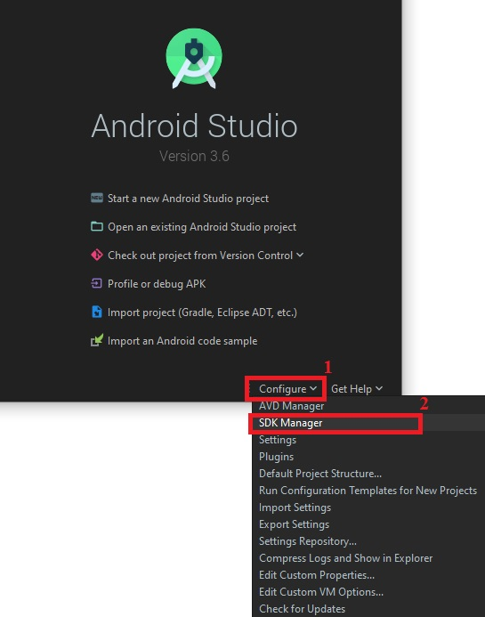
#### - Oznaczyć werjsę Android 9.0 (Pie) i pobrać(po oznaczeniu, pojawi się opcja pobrania), a w przypadku już pobranego widok będzie jak poniżej
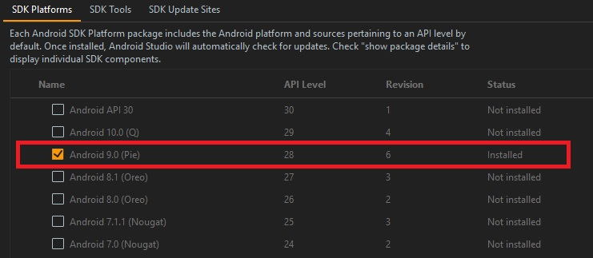

### Uruchomienie aplikacji
#### - Pobrać zapakowany projekt (ZIP) i rozpakować w wybranej lokalizacji
#### - Uruchomić Android Studio
#### - Wybrać wskazaną opcję
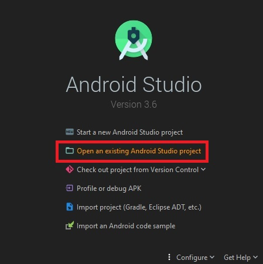
#### - Odnaleźć rozpakowany projekt
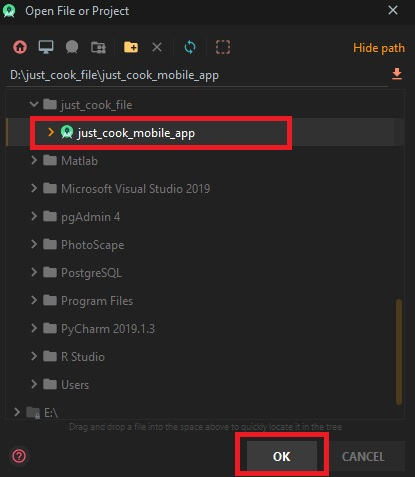
#### - Możliwe, że Android Studio zasugeruje konfigurację projektu i będzie można uruchomić aplikację od razu. W przeciwnym razie należy zrobić to samemu

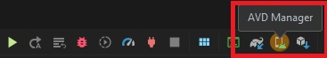
#### - Dodajemy emulator
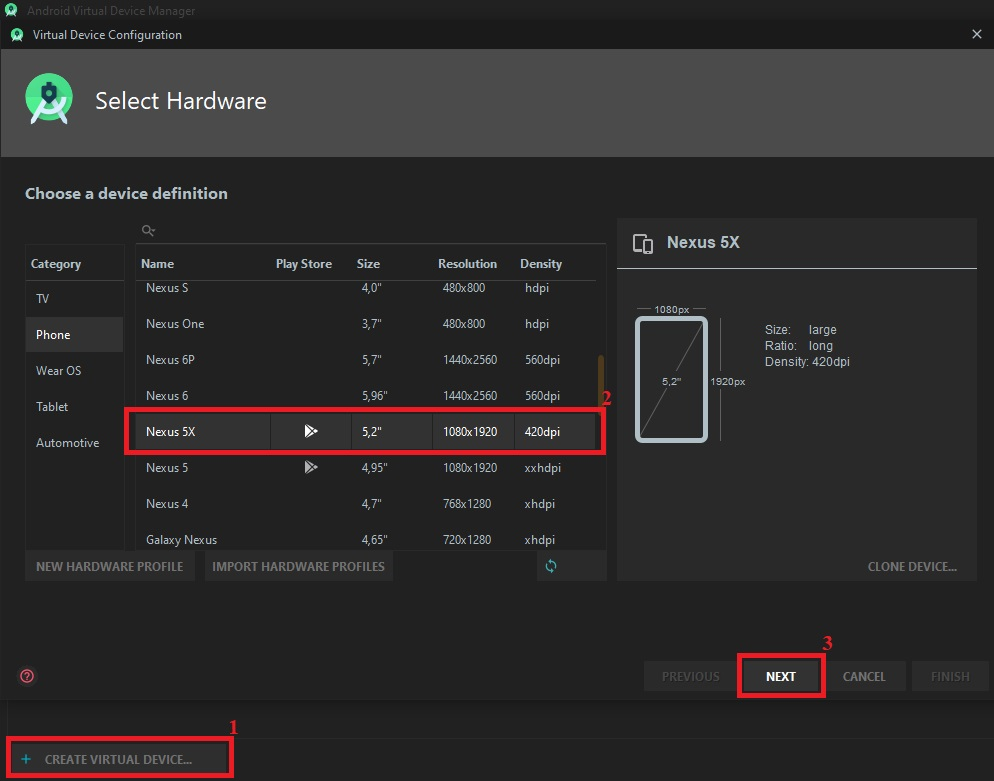
#### - Wybieramy system operacyjny Android 9.0 (Pie)
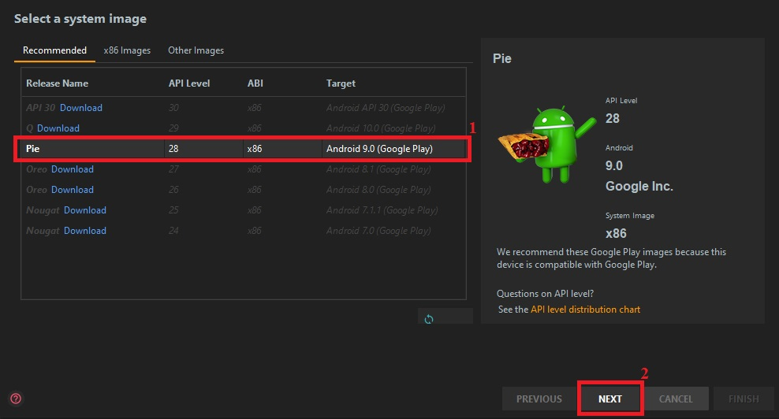
#### - Możemy nadać nazwę naszemu emulatorowi, aby łatwiej go rozpoznać
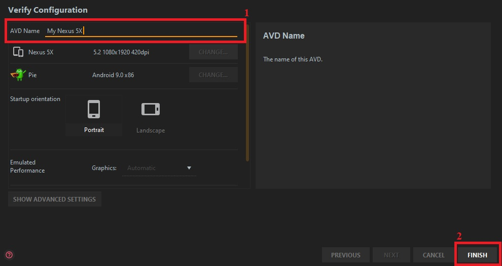
#### - Po poprawnej konfiguracji nasze urządzenie powinno być widoczne w AVD Manager
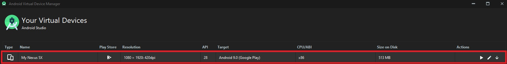
#### - Przechodzimy do uruchomienia aplikacji
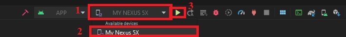
#### - Aplikacja została zbudowana i jest gotowa do użycia na emulatorze
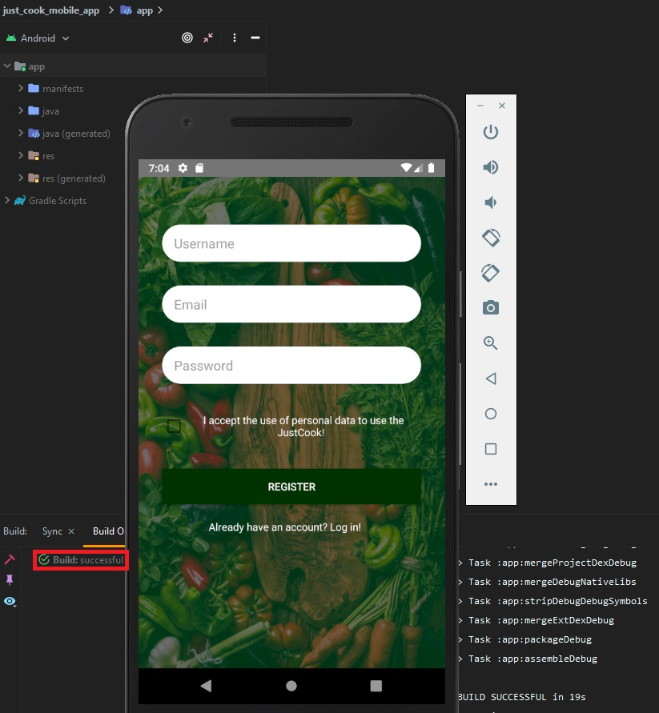

### Błąd przy pierwszym uruchomieniu związany z plikami nie posiadającymi rozszerzenia .xml
#### Taki błąd może wystąpić jednorazowo podczas pierwszej próby rozruchu aplikacji. W takim przypadku należy uruchomić widok projektu, odnaleźć folder readme i usunąć go.
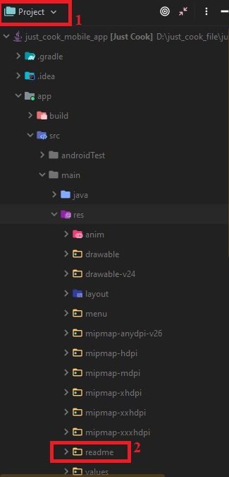

# Obsługa aplikacji

### Rejestracja uzytkownika
####   Uzupelnic kolejno pola wpisujac: nazwe uzytkownika, adres mail, haslo.
####   Należy zaakceptować regulamin aplikacji oraz nacisnąć przycisk rejestracji.
####   W tym momencia nasz uzytkownik zostal dodany do bazy danych,
####   a my możemy w pelni korzystać z usług aplikacji.

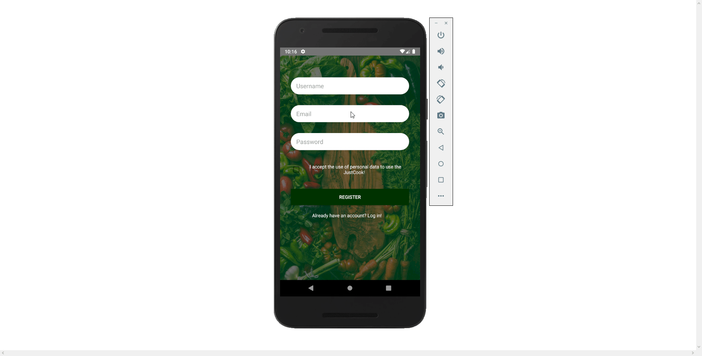
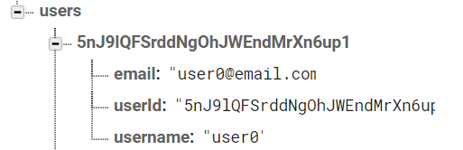

### Adding user to database
<!--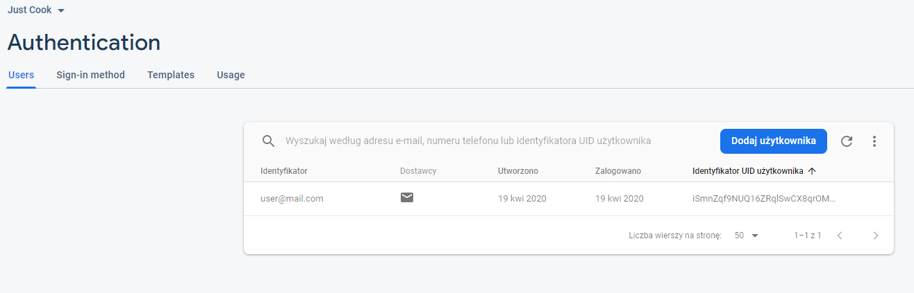-->

### Logowanie użytkownika
####    Żeby się zalogować, należy uzupełnić pola wpisując: e-mail oraz hasło.
####    Gdy użytkownik zostanie odnaleziony w bazie, a dane logowania będą się zgadzać, ten zostanie przeniesiony do ekranu głównego aplikacji.
####    W przypadku nie odnalezienia użytkownika o podanym e-mailu oraz haśle, użytkownik zostanie o tym poinformowany.

