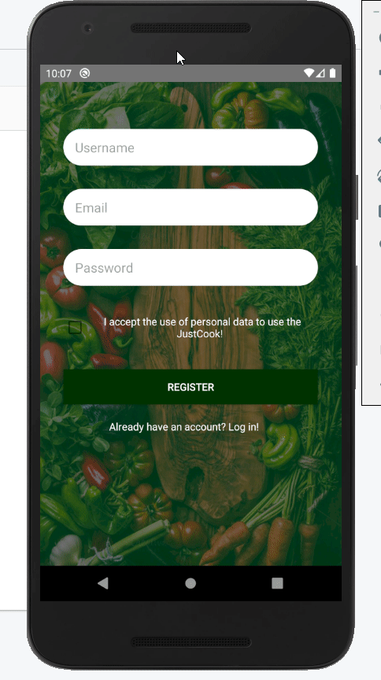
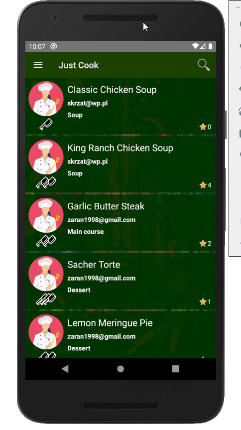
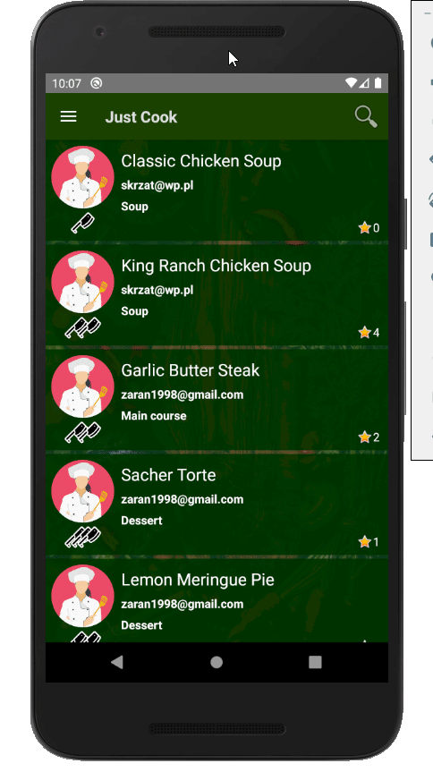
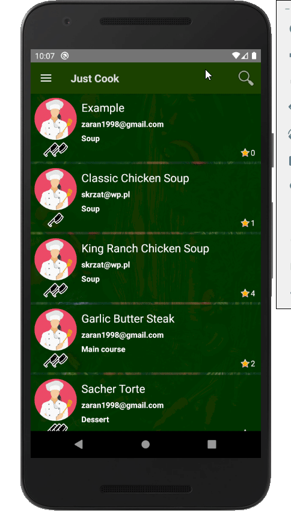
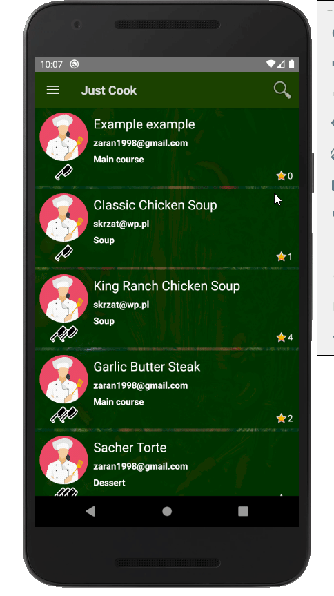

## Konfiguracja projektu
### Pobieranie SDK
#### - Uruchomić Android Studio
#### - Pobrać platformę SDK

#### - Oznaczyć werjsę Android 9.0 (Pie) i pobrać(po oznaczeniu, pojawi się opcja pobrania), a w przypadku już pobranego widok będzie jak poniżej

### Uruchomienie aplikacji
#### - Pobrać zapakowany projekt (ZIP) i rozpakować w wybranej lokalizacji
#### - Uruchomić Android Studio
#### - Wybrać wskazaną opcję

#### - Odnaleźć rozpakowany projekt

#### - Możliwe, że Android Studio zasugeruje konfigurację projektu i będzie można uruchomić aplikację od razu. W przeciwnym razie należy zrobić to samemu

#### - Dodajemy emulator

#### - Wybieramy system operacyjny Android 9.0 (Pie)

#### - Możemy nadać nazwę naszemu emulatorowi, aby łatwiej go rozpoznać

#### - Po poprawnej konfiguracji nasze urządzenie powinno być widoczne w AVD Manager

#### - Przechodzimy do uruchomienia aplikacji

#### - Aplikacja została zbudowana i jest gotowa do użycia na emulatorze

### Błąd przy pierwszym uruchomieniu związany z plikami nie posiadającymi rozszerzenia .xml
#### Taki błąd może wystąpić jednorazowo podczas pierwszej próby rozruchu aplikacji. W takim przypadku należy uruchomić widok projektu, odnaleźć folder readme i usunąć go.

# Obsługa aplikacji

### Rejestracja uzytkownika
####   Uzupelnic kolejno pola wpisujac: nazwe uzytkownika, adres mail, haslo.
####   Należy zaakceptować regulamin aplikacji oraz nacisnąć przycisk rejestracji.
####   W tym momencia nasz uzytkownik zostal dodany do bazy danych,
####   a my możemy w pelni korzystać z usług aplikacji.

<!---->

### Logowanie użytkownika
####    Żeby się zalogować, należy uzupełnić pola wpisując: e-mail oraz hasło.
####    Gdy użytkownik zostanie odnaleziony w bazie, a dane logowania będą się zgadzać, ten zostanie przeniesiony do ekranu głównego aplikacji.
####    W przypadku nie odnalezienia użytkownika o podanym e-mailu oraz haśle, użytkownik zostanie o tym poinformowany.

### Logowanie automatyczne
####    Logowanie użytkownika odbywa się automatycznie przy każdym starcie aplikacji, pod warunkiem, że ten nie użył opcji wylogowania.

### Wylogowanie użytkownika
####    Wylogowanie użytkownika odbywa się poprzez wybranie z menu nawigacyjnego opcji "Logout".
####    Użycie tej opcji spowoduje, że użytkownik nie zostanie automatycznie zalogowany przy następnym starcie aplikacji.

### Wyszukiwanie przepisów
####    Aby wyszukać interesujące nas przepisy, należy wybrać z menu nawigacyjnego interesującą nas kategorię.
####    Alternatywą jest wyszukiwanie przepisów po nazwie, które odbywa się po kliknięciu ikony lupy, wpisaniu poszukiwanej frazy oraz wyszukaniu przez kliknięcie lupy przy polu do wprowadzania.

### Wyświetlanie / ocenianie / komentowanie przepisu
####    Żeby wyświetlić przepis, należy kliknąć na blok zawierający ten, który nas interesuje.
####    Ocenianie odbywa się poprzez nasiścięcie gwiazdki. Akcja ta doda 1 do całkowicej oceny przepisu.
####    Żeby skomentować przepis, należy nacisnąć pasek "Show comments", by wyświetlić komentarze, następnie należy napisać treść komentarza w przeznaczonym do tego polu, a następnie nacisnąć przycisk odpowiedzialny za wysłanie komentarza.
####    Chcąc wrócić do menu głównego aplikacji należy nacisnąć przycisk cofania w androidzie.

### Dodanie nowego przepisu
####    By dodać nowy przepis, należy z menu nawigacyjnego wybrać opcję "Add recipe", która przeniesie nas do ekranu dodawania nowego przepisu.
####    Należy w tym miejscu uzupełnić informacje takie jak: nazwa przepisu, poziom trudności, typ przepisu, składniki, oraz kroki wykonywania przepisu.
####    Po upewnieniu się, że informacje się zgadzają, należy nacisnąć przycisk "ADD RECIPE".
####    Naciśnięcie przycisku doda przepis do bazy, oraz wróci użytkownika do ekranu głównego.

### Wyszukanie autorskich przepisów
####    By wyszukać autorskie przepisy, należy wybrać z menu nawigacyjnego opcję "My Recipes".

### Edytowanie przepisu
####    W aplikacji opcja ta jest jedynie dostępna dla autora przepisu.
####    By edytować przepis, należy wybrać stworzony przez nas przepis z ekranu menu głównego.
####    Po wyświetleniu przepisu, dostępna będzie opcja "EDIT RECIPE", która przeniesie użytkownika do ekranu edycji przepisu.
####    Edycja przepisu wygląda analogicznie do dodawania nowego przepisu.
####    Po zakończeniu edytowania, należy wybrać przycisk "EDIT RECIPE", który zaktualizuje dane w bazie, oraz wróci użytkownika do podglądu starej wersji przepisu.
####    Chcąc wyświetlić nową wersję przepisu należy odświeżyć listę przepisów i następnie wybrać edytowany przez nas przepis.

### Usunięcie przepisu
####    W aplikacji opcja ta jest jedynie dostępna dla autora przepisu.
####    By usunąć przepis, należy wybrać stworzony przez nas przepis z menu głównego.
####    Po wyświetleniu przepisu, dostępna będzie opcja "DELETE RECIPE", która wyświetli menu dialogowe, oczekujące potwierdzenia decycji.
####    Po usunięciu przepisu, użytkownik zostanie przeniesiony do menu głównego.

